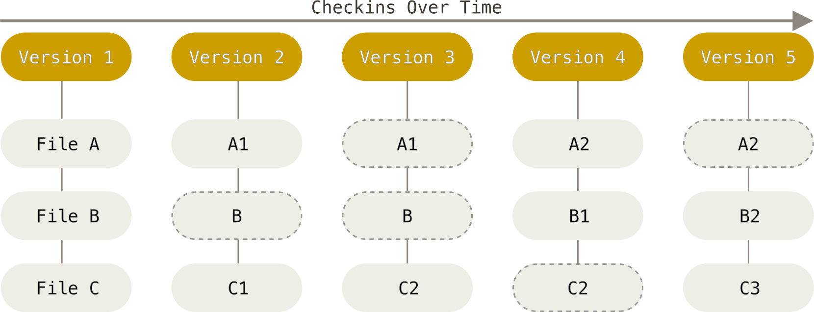
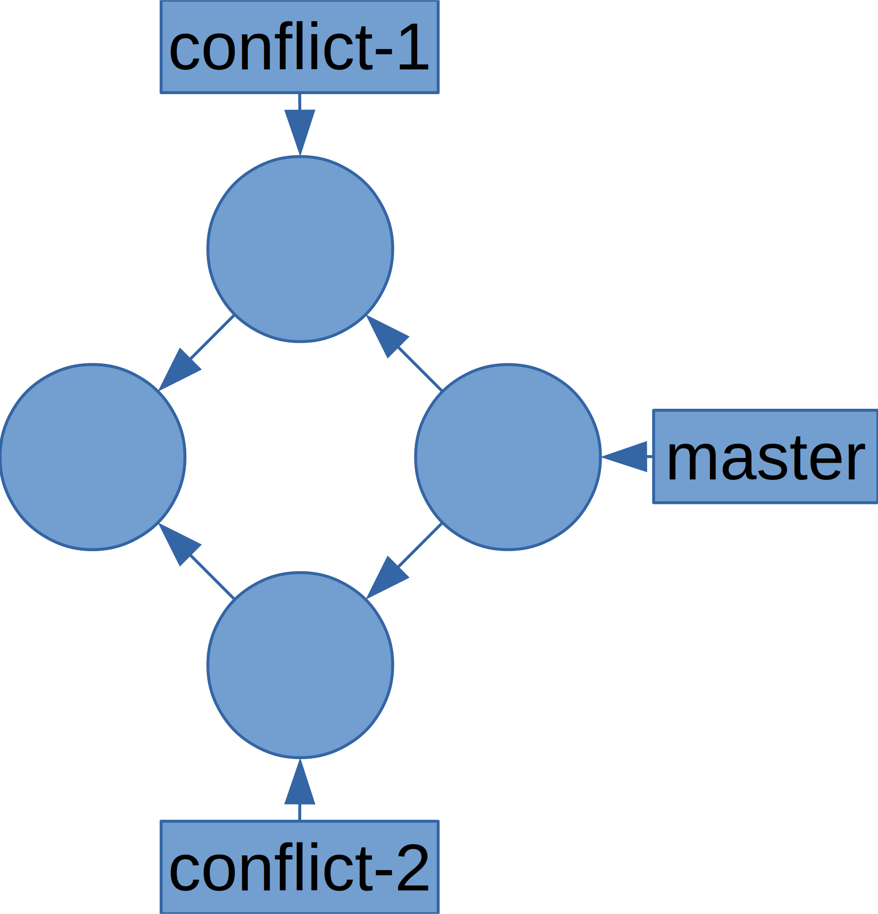
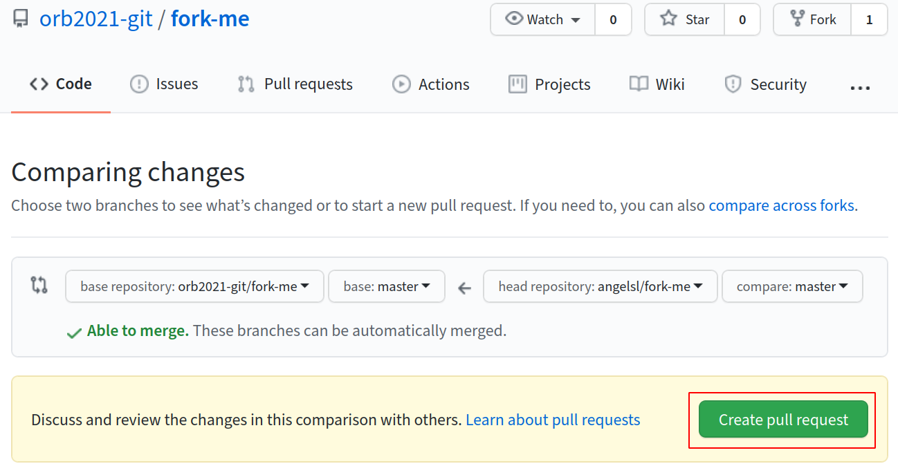
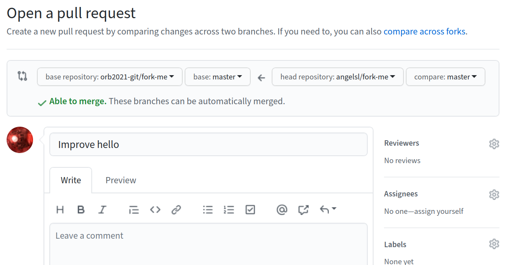

::: reveal
::: slides
::: section
# Introduction to Git

[{.logo-img
style="height: 5ex;"}](https://nushackers.org){target="_blank"}
:::

::: section
## Slides

https://hackerschool-git.github.io/slides-2120/
:::

::: section
## Things you need

[{.logo-img style="height: 5ex;"}](https://git-scm.com)

[{.logo-img
style="height: 5ex;"}](https://github.com)
:::

::: section
## Things to keep with you

-   [Git manual](https://git-scm.com/docs)
-   [{.logo-img
    style="height: 10ex;"}](https://git-scm.com/book/en/v2)
:::

::: section
## What is Git?

A distributed version control system (DVCS)

Every commit is a *snapshot* of your files

{.white-bg}
:::

::: section
## The three \"areas\"

-   Working directory: where you actually work
-   Index/\"staging\" area: where you construct a commit
-   Repository/commit: the repository itself

{.white-bg style="height: 15ex"}
:::

::: section
## Getting started

In each commit, Git stores the author and committer\'s name and email

You need to configure Git:

    git config --global user.name "Your Name"
    git config --global user.email "your@email.com"
:::

::: section
## Setting your editor

Git sometimes launches an editor e.g. when you `commit`, to edit the
commit message

Configure your favourite editor:

    git config --global core.editor nano
    git config --global core.editor emacs
    git config --global core.editor "code --wait --new-window" # VS Code
    git config --global core.editor "'C:/Program Files/Notepad++/notepad++.exe' -multiInst -nosession"
    git config --global core.editor "'C:/Program Files/Microsoft VS Code/code.exe' -n -w"
:::

::: section
## Git manual

You can always access the help for a command via

`git help `[`cmd`]{.underline}

or access the help summary by

`git `[`cmd`]{.underline}` -h`
:::

::: section
## Initialising a repository

Let\'s create a new Git repository.

    $ mkdir my-git-repo
    $ cd my-git-repo
    $ git init
    Initialized empty Git repository in my-git-repo/.git/
:::

::: section
## Stage a file

Create a new file in `my-git-repo`, however you want. Then add it:

    $ echo 'Hello world' > hello
    $ git add hello
:::

::: section
## Check the status

We\'ve just staged a file! So what is the state of the repository?

    $ git status
    On branch master

    No commits yet

    Changes to be committed:
      (use "git rm --cached <file>..." to unstage)

        new file:   hello
:::

::: section
## Look at the staged diff

What exactly did we stage?

    $ git diff --staged
    diff --git a/hello b/hello
    new file mode 100644
    index 0000000..802992c
    --- /dev/null
    +++ b/hello
    @@ -0,0 +1 @@
    +Hello world
:::

::: section
## Make your first commit

    $ git commit -m "Add hello"
    [master (root-commit) 5d74ce3] Add hello
     1 file changed, 1 insertion(+)
     create mode 100644 hello

You can leave the [        ]{.mark} part out. Git will open your editor
for you to compose a commit message.
:::

::: section
## Look at your commit

    $ git show
    commit dc37b1cb2627f9829db0072cfa7d3d6bf9eb6822 (HEAD -> master)
    Author: Your Name <your@email.com>
    Date:   Sat May 8 21:16:45 2021 +0800

        Add hello

    diff --git a/hello b/hello
    new file mode 100644
    index 0000000..802992c
    --- /dev/null
    +++ b/hello
    @@ -0,0 +1 @@
    +Hello world
:::

::: section
## Make some changes, and look at them

Make edits to `hello` (or whatever file you made), then

    $ git diff
    diff --git a/hello b/hello
    index 802992c..5d56d4d 100644
    --- a/hello
    +++ b/hello
    @@ -1 +1 @@
    -Hello world
    +Hello Hackerschool!
:::

::: section
## Summary so far

-   [`git init`](https://git-scm.com/docs/git-init): Initialise
    repository
-   [`git add`](https://git-scm.com/docs/git-add): Stage changes
-   [`git diff`](https://git-scm.com/docs/git-diff)` `[`(--staged)`](https://git-scm.com/docs/git-diff#Documentation/git-diff.txt-emgitdiffemltoptionsgt--ltpathgt82308203):
    Look at differences between working tree and index (`--staged`:
    index and current commit)
-   [`git status`](https://git-scm.com/docs/git-status): Look at
    repository status
-   [`git commit`](https://git-scm.com/docs/git-commit)` `[`(-m)`](https://git-scm.com/docs/git-commit#Documentation/git-commit.txt--mltmsggt):
    Commit staged changes (`-m`: with this commit message)
-   [`git show`](https://git-scm.com/docs/git-show): Show current commit

The commands\' manuals are linked. (They all have *many* more options
than what we\'ve covered.)
:::

::: section
## Viewing commit history

    $ git log
    commit 19c32155172a20f2fd14fe0e6c0fea954c17296b (HEAD -> master)
    Author: Your Name <your@email.com>
    Date:   Sat May 8 21:36:58 2021 +0800

        Change world to Hackerschool!

    commit dc37b1cb2627f9829db0072cfa7d3d6bf9eb6822
    Author: Your Name <your@email.com>
    Date:   Sat May 8 21:16:45 2021 +0800

        Add hello
:::

::: section
::: section
## Ignoring files

Sometimes we don\'t want Git to track a certain file

    $ touch ignore-me
    $ git status
    On branch master
    Untracked files:
      (use "git add <file>..." to include in what will be committed)

        ignore-me

    nothing added to commit but untracked files present (use "git add" to track)
:::

::: section
## Ignoring files

We can add it to `.gitignore`

    $ echo "/ignore-me" >> .gitignore
    $ git status
    On branch master
    Untracked files:
      (use "git add <file>..." to include in what will be committed)

        .gitignore

    nothing added to commit but untracked files present (use "git add" to track)

`.gitignore` should be committed.
:::

::: section
## Ignoring files

    $ git add .gitignore && git commit -m "Add .gitignore"
    [master 5ada1cf] Add .gitignore
     1 file changed, 1 insertion(+)
     create mode 100644 .gitignore
    $ git status
    On branch master
    nothing to commit, working tree clean
    $ git status --ignored
    On branch master
    Ignored files:
      (use "git add -f <file>..." to include in what will be committed)

        ignore-me

    nothing to commit, working tree clean
:::

::: section
## What to ignore?

Typically, we ignore files like build artifacts and generated files that
are usually derived from the human-authored code in the repository. E.g.

-   dependency caches like `/node_modules`
-   compiled code like `.o`, `.pyc` files
-   build output directories like `/bin`, `/out`
-   runtime-generated files like log files
-   personal configuration files e.g. of your IDE
:::

::: section
## `.gitignore` format

    /logs/*/*.log
    /logs/**/*.log
    **/logs
    **/logs/debug.log
    *.log
    /debug.log
    debug.log

[See the full pattern
format.](https://git-scm.com/docs/gitignore#_pattern_format)
:::
:::

::: section
# Branching and collaboration
:::

::: {.section .font75}
## Branches

\... let you have multiple lines of development happen simultaneously.

In Git, branching is extremely fast and lightweight. A branch is simply
a pointer to a commit; the default branch is typically `master` or
`main`.

`HEAD` is a special pointer to the branch you are currently on.

{.white-bg style="height: 20ex;"}
:::

::: section
::: section
## Creating a branch

    $ git checkout -b new-feature
    Switched to a new branch 'new-feature'
    $ git show
    commit 5ada... (HEAD -> new-feature, master)
    Author: Your Name <your@email.com>
    Date:   Sat May 8 21:44:32 2021 +0800

        Add .gitignore

Alternatively:

    $ git branch new-feature
    $ git checkout new-feature
    Switched to branch 'new-feature'
:::

::: section
## Creating a branch

{.white-bg}
:::
:::

::: section
## Listing branches

    $ git branch
      master
    * new-feature
:::

::: section
## Changing branches

    $ git checkout master
    Switched to branch 'master'
:::

::: section
::: section
## Fast-forward merging

Let\'s develop `new-feature` a bit, then merge it back to `master`.

    $ echo "bye" > bye
    $ git add bye && git commit -m "Add farewell"
    [new-feature b53e9cf] Add farewell
     1 file changed, 1 insertion(+)
     create mode 100644 bye
:::

::: section
## Fast-forward merging

{.white-bg}
:::

::: section
## Fast-forward merging

    $ git checkout master
    Switched to branch 'master'
    $ git merge new-feature
    Updating 5ada1cf..b53e9cf
    Fast-forward
     bye | 1 +
     1 file changed, 1 insertion(+)
     create mode 100644 bye
:::

::: section
## Fast-forward merging

{.white-bg}
:::
:::

::: section
## Deleting branches

Now that we\'re done with `new-feature`, we can delete it.

    $ git branch -d new-feature
    Deleted branch new-feature (was b53e9cf).
:::

::: section
::: section
## Cloning repositories

We\'re going to clone a repository to use later on. Go to
[merge-conflict](https://github.com/hackerschool-git/merge-conflict),
and look for this:

{style="height: 20ex;"}
:::

::: section
## Cloning repositories

    $ git clone https://github.com/hackerschool-git/merge-conflict.git
    Cloning into 'merge-conflict'...
    remote: Enumerating objects: 18, done.
    remote: Counting objects: 100% (18/18), done.
    remote: Compressing objects: 100% (10/10), done.
    remote: Total 18 (delta 0), reused 18 (delta 0), pack-reused 0
    Unpacking objects: 100% (18/18), done.
    $ cd merge-conflict/
    $ ls
    bye
:::
:::

::: section
## Merge conflicts setup

First, checkout `conflict-1` and `conflict-2` to create your local
copies of the branches. Then go back to `master`.

    $ git checkout conflict-1
    Branch 'conflict-1' set up to track remote branch 'conflict-1' from 'origin'.
    Switched to a new branch 'conflict-1'
    $ git checkout conflict-2
    Branch 'conflict-2' set up to track remote branch 'conflict-2' from 'origin'.
    Switched to a new branch 'conflict-2'
    $ git checkout master
    Switched to branch 'master'
    Your branch is up to date with 'origin/master'.
:::

::: section
::: section
## Merge conflicts

{.white-bg}
:::

::: section
## Merge conflicts

    $ git log --graph --all
    * commit ba119655f9009085d5f3fd72cf29787fe1aef05f (origin/conflict-2)
    | Author: Your Name <your@email.com>
    | Date:   Sun May 9 00:15:38 2021 +0800
    |
    |     Change bye to farewell
    |
    | * commit 87a92c314d38f8941f61053991086d16f08a5d6f (origin/conflict-1)
    |/  Author: Your Name <your@email.com>
    |   Date:   Sun May 9 00:15:15 2021 +0800
    |
    |       Make bye more formal
    |
    * commit b53e9cfb656a633f207b6099bf413c08a0011af5 (HEAD -> master, origin/master, origin/HEAD)
:::

::: section
## Merge conflicts

Now, try to merge `conflict-1` and `conflict-2` into `master`.

    $ git merge conflict-1
    Updating b53e9cf..87a92c3
    Fast-forward
     bye | 2 +-
     1 file changed, 1 insertion(+), 1 deletion(-)
    $ git merge conflict-2
    Auto-merging bye
    CONFLICT (content): Merge conflict in bye
    Automatic merge failed; fix conflicts and then commit the result.

Oh no! [[Time to delete everything and start
over!](https://xkcd.com/1597/)]{style="font-size: 50%; text-decoration: line-through;"}
:::

::: section
## Handling merge conflicts

    $ git status
    On branch master
    Your branch is ahead of 'origin/master' by 1 commit.
    (use "git push" to publish your local commits)

    You have unmerged paths.
    (fix conflicts and run "git commit")
    (use "git merge --abort" to abort the merge)

    Unmerged paths:
    (use "git add <file>..." to mark resolution)

    both modified:   bye

    no changes added to commit (use "git add" and/or "git commit -a")
:::

::: section
## Handling merge conflicts

    $ cat bye
    <<<<<<< HEAD
    Goodbye!
    =======
    Farewell!
    >>>>>>> conflict-2

[What we have in `master`]{.mark}

[What we want to merge in `conflict-2`]{.mark-red}
:::

::: section
## Handling merge conflicts

Fix the merge conflict however you\'d like, then commit.

    $ echo 'Farewell!' > bye
    $ git add bye && git commit
    [master 00e746b] Merge branch 'conflict-2'
    $ git show
    commit 00e746be657f4ca8e2adde376d09dd6af0533008 (HEAD -> master)
    Merge: 87a92c3 ba11965
    Author: Your Name <your@email.com>
    Date:   Sun May 9 00:43:12 2021 +0800

        Merge branch 'conflict-2'
:::

::: section
## Handling merge conflicts

{.white-bg}
:::
:::

::: section
::: section
## Creating a new GitHub repository


:::

::: section
## Creating a new GitHub repository


:::

::: section
## Creating a new GitHub repository

{style="height: 22ex;"}
:::

::: section
## Pushing to a new GitHub repository

    $ mkdir my-new-repo && cd my-new-repo
    $ git init
    Initialized empty Git repository in /tmp/my-new-repo/.git/
    $ echo 'Hello world!' > hello
    $ git add hello && git commit -m "Initial commit"
    [master (root-commit) 18cac44] Initial commit
     1 file changed, 1 insertion(+)
     create mode 100644 hello
    $ git remote add origin git@github.com:.../my-new-repo.git
    $ git push -u origin master
    Enumerating objects: 3, done.
    Counting objects: 100% (3/3), done.
    Writing objects: 100% (3/3), 220 bytes | 220.00 KiB/s, done.
    Total 3 (delta 0), reused 0 (delta 0)
    To github.com:.../my-new-repo.git
     * [new branch]      master -> master
    Branch 'master' set up to track remote branch 'master' from 'origin'.
:::
:::

::: section
::: section
## Updating your repository

    $ git pull origin master
    From https://github.com/hackerschool-git/fork-me
     * branch            master     -> FETCH_HEAD
    Already up to date.

Alternatively, if your branch is tracking a remote:

    $ git pull
    Already up to date.

`pull` is roughly equivalent to a `fetch` and `merge`.

So if there are merge conflicts, you handle them as you did earlier.
:::

::: section
## Updating with rebase

    $ git pull --rebase
    Already up to date.
:::

::: section
## Rebase vs merge

{.white-bg}

{.white-bg}
:::
:::

::: section
## HTTPS vs SSH

It doesn\'t really matter.

Use HTTPS if you don\'t have an SSH key set up with GitHub, or if it is
a repository that you cannot write to.

Use SSH if you have an SSH key set up, and you can write to the
repository.
:::

::: section
## Forking and PR setup

Clone this repository:
[fork-me](https://github.com/hackerschool-git/fork-me).

    $ git clone https://github.com/hackerschool-git/fork-me.git
    Cloning into 'fork-me'...
    remote: Enumerating objects: 3, done.
    remote: Counting objects: 100% (3/3), done.
    remote: Total 3 (delta 0), reused 3 (delta 0), pack-reused 0
    Unpacking objects: 100% (3/3), done.
:::

::: section
::: section
## Forking and PR

You\'ve made some improvements, and now you want it upstreamed!

    $ cd fork-me/
    $ nano hello # Edit hello
    $ git add hello && git commit -m "Improve hello"
    [master df48f95] Improve hello
     1 file changed, 1 insertion(+), 1 deletion(-)
:::

::: section
## Forking and PR

Fork the repository:


:::

::: section
## Forking and PR

Get the URL:


:::

::: section
## Update your repository

Make sure there haven\'t been new changes made to the upstream.

    $ git pull --rebase
    Already up to date.

We use `--rebase` because merge commits are generally frowned-upon in
GitHub-style PRs.
:::

::: section
## Forking and PR

Add the remote, and push

    $ git remote add fork git@github.com:.../fork-me.git
    $ git push fork master
    Enumerating objects: 5, done.
    Counting objects: 100% (5/5), done.
    Writing objects: 100% (3/3), 248 bytes | 248.00 KiB/s, done.
    Total 3 (delta 0), reused 0 (delta 0)
    To github.com:.../fork-me.git
       18cac44..df48f95  master -> master
:::

::: section
## Forking and PR


:::

::: section
## Forking and PR


:::

::: section
## Forking and PR


:::
:::

::: section
::: section
## Commit message discipline

First line: 80-character title, phrased imperatively

Then if your change is complex, elaborate on the change in prose.

``` font45
Change greeting from "Hi" to "Hello"

"Hi" is a bit too informal for a greeting. We should change it to "Hello" instead,
so that our users don't feel like we are being too informal. Blah blah blah blah.
Blah blah.
```
:::

::: section
## A real commit message

[Randomly chosen from the Linux
kernel.](https://git.kernel.org/pub/scm/linux/kernel/git/torvalds/linux.git/commit/?id=37c0aead7902b1ddf1b668e1ab74c80b9a7fd183)

``` font45
net_sched: sch_fq: handle non connected flows

FQ packet scheduler assumed that packets could be classified
based on their owning socket.

This means that if a UDP server uses one UDP socket to send
packets to different destinations, packets all land
in one FQ flow.

This is unfair, since each TCP flow has a unique bucket, meaning
that in case of pressure (fully utilised uplink), TCP flows
have more share of the bandwidth.

If we instead detect unconnected sockets, we can use a stochastic
hash based on the 4-tuple hash.

This also means a QUIC server using one UDP socket will properly
spread the outgoing packets to different buckets, and in-kernel
pacing based on EDT model will no longer risk having big rb-tree on
one flow.

Note that UDP application might provide the skb->hash in an
ancillary message at sendmsg() time to avoid the cost of a dissection
in fq packet scheduler.

Signed-off-by: Eric Dumazet <edumazet@google.com>
Signed-off-by: David S. Miller <davem@davemloft.net>
```
:::
:::

::: section
## GitHub tip

You can create [pull
requests](https://github.com/nushackers/nushackers-site/pull/252)
between branches in the same repository.

This is useful if you want your partner to review something before
merging, or if you set up automated CI checks, etc.

{style="height: 12ex"}
:::

::: section
## Summary since the last summary

-   [`git log`](https://git-scm.com/docs/git-log): View the log
-   `.gitignore`: Ignore files
-   [`git checkout`](https://git-scm.com/docs/git-checkout): Checkout a
    branch (and also files, etc)
-   [`git merge`](https://git-scm.com/docs/git-merge): Merge a branch
-   [`git clone`](https://git-scm.com/docs/git-clone): Clone a remote
    repository
-   [`git remote`](https://git-scm.com/docs/git-remote): Manage remotes
-   [`git push`](https://git-scm.com/docs/git-push): Push your branch to
    a remote
-   [`git pull`](https://git-scm.com/docs/git-pull): Pull updates from a
    remote to your repository
:::

::: section
# Commit manipulation
:::

::: section
::: section
## Clone another repo

Let\'s clone [another
repository](https://github.com/hackerschool-git/big-repo) to use for
this section.

    $ git clone https://github.com/hackerschool-git/big-repo.git
    Cloning into 'big-repo'...
    remote: Enumerating objects: 12, done.
    remote: Counting objects: 100% (12/12), done.
    remote: Compressing objects: 100% (5/5), done.
    remote: Total 12 (delta 0), reused 12 (delta 0), pack-reused 0
    Receiving objects: 100% (12/12), done.
:::

::: section
## This repository

    $ git log --graph --all --oneline
    * d1f4fcc (HEAD -> master, origin/master, origin/HEAD) Add file3
    | * 367597c (origin/new-file) Add file2
    |/
    * 643aec6 Update file to c
    * 4ec21c7 Update file to b
    * 055cab4 Initial commit
:::
:::

::: section
::: section
## Revert

Create a commit to reverse a previous commit.

    $ git log --graph --oneline
    * d1f4fcc (HEAD -> master, origin/master, origin/HEAD) Add file3
    * 643aec6 Update file to c
    * 4ec21c7 Update file to b
    * 055cab4 Initial commit

Suppose we want to revert [this]{.mark} commit.
:::

::: section
## Revert

    $ git revert 643aec6
    [master 7b73baf] Revert "Update file to c"
     1 file changed, 1 insertion(+), 1 deletion(-)
    $ git show
    commit 7b73baf229e2b8db19bc594c450743b50adf649d (HEAD -> master)
    Author: Your Name <your@email.com>
    Date:   Tue May 11 01:21:31 2021 +0800

        Revert "Update file to c"

        This reverts commit 643aec6d2a1b4cd485d678886fc1cef25b15bee0.

    diff --git a/file b/file
    index f2ad6c7..6178079 100644
    --- a/file
    +++ b/file
    @@ -1 +1 @@
    -c
    +b
:::
:::

::: section
## Reset

Undo `git add`.

    $ echo e > file
    $ git add file
    $ git status
    On branch master
    Changes to be committed:
      (use "git restore --staged <file>..." to unstage)
        modified:   file
    $ git reset file
    Unstaged changes after reset:
    M   file
    $ git status
    On branch master
    Changes not staged for commit:
      (use "git add <file>..." to update what will be committed)
      (use "git restore <file>..." to discard changes in working directory)
        modified:   file
    no changes added to commit (use "git add" and/or "git commit -a")
:::

::: section
## Checkout

Undo changes to a file in the working tree.

    $ echo e > file
    $ git status
    On branch master
    Changes not staged for commit:
      (use "git add <file>..." to update what will be committed)
      (use "git restore <file>..." to discard changes in working directory)
        modified:   file

    no changes added to commit (use "git add" and/or "git commit -a")
    $ git checkout -- file
    $ git status
    On branch master
    nothing to commit, working tree clean
:::

::: section
::: section
## Cherry-pick

\"Pluck\" a commit(s) and apply it to your current branch.

    $ git log --graph --oneline --all
    * 7b73baf (HEAD -> master) Revert "Update file to c"
    * d1f4fcc (origin/master, origin/HEAD) Add file3
    * 367597c (origin/new-file) Add file2
    |/
    * 643aec6 Update file to c
    * 4ec21c7 Update file to b
    * 055cab4 Initial commit

We want [this]{.mark} commit to be a child of `7b73baf`.
:::

::: section
## Cherry-pick

    $ git cherry-pick 367597c
    [master aff5aa7] Add file2
     Date: Tue May 11 00:27:26 2021 +0800
     1 file changed, 1 insertion(+)
     create mode 100644 file2
:::

::: section
## Cherry-pick

    $ git log --graph --oneline --all
    * aff5aa7 (HEAD -> master) Add file2
    * 7b73baf Revert "Update file to c"
    * d1f4fcc (origin/master, origin/HEAD) Add file3
    | * 367597c (origin/new-file) Add file2
    |/
    * 643aec6 Update file to c
    * 4ec21c7 Update file to b
    * 055cab4 Initial commit

Commit plucked!
:::
:::

::: section
::: section
## Reset (2)

Reset also *moves* a branch. Three modes of reset:

-   Hard: move the branch, and reset the index (staging area) and
    working tree.
-   Mixed: move the branch and reset the index, but leave the working
    tree.
-   Soft: move the branch only.
:::

::: section
## Reset (2)

    $ git log --graph --oneline --all
    * aff5aa7 (HEAD -> master) Add file2
    * 7b73baf Revert "Update file to c"
    * d1f4fcc (origin/master, origin/HEAD) Add file3
    | * 367597c (origin/new-file) Add file2
    |/
    * 643aec6 Update file to c
    * 4ec21c7 Update file to b
    * 055cab4 Initial commit

We want master to point to [this]{.mark} commit again. (i.e. discard the
cherry-pick we did)
:::

::: section
## Reset (2)

    $ git reset --hard 7b73baf
    HEAD is now at 7b73baf Revert "Update file to c"
    $ git log --graph --all --oneline
    * 7b73baf (HEAD -> master) Revert "Update file to c"
    * d1f4fcc (origin/master, origin/HEAD) Add file3
    | * 367597c (origin/new-file) Add file2
    |/
    * 643aec6 Update file to c
    * 4ec21c7 Update file to b
    * 055cab4 Initial commit

Warning: don\'t do this if you\'ve already pushed!
:::
:::

::: section
## Rebase

Pluck *your current branch* and put it on top of another branch.

    $ git checkout new-file
    Branch 'new-file' set up to track remote branch 'new-file' from 'origin'.
    Switched to a new branch 'new-file'
    $ git rebase master
    Successfully rebased and updated refs/heads/new-file.
    $ git log --graph --all --oneline
    * 95f989c (HEAD -> new-file) Add file2
    * 7b73baf (master) Revert "Update file to c"
    * d1f4fcc (origin/master, origin/HEAD) Add file3
    | * 367597c (origin/new-file) Add file2
    |/
    * 643aec6 Update file to c
    * 4ec21c7 Update file to b
    * 055cab4 Initial commit
:::

::: section
## Interactive add

Choose specific changes to stage

    $ git add -p
    diff --git a/file b/file
    index 6178079..de98044 100644
    --- a/file
    +++ b/file
    @@ -1 +1,3 @@
    +a
     b
    +c
    (1/1) Stage this hunk [y,n,q,a,d,s,e,?]? s
    Split into 2 hunks.
    @@ -1 +1,2 @@
    +a
     b
    (1/2) Stage this hunk [y,n,q,a,d,j,J,g,/,e,?]? y
    @@ -1 +2,2 @@
     b
    +c
    (2/2) Stage this hunk [y,n,q,a,d,K,g,/,e,?]? n

    $ git diff --staged
    diff --git a/file b/file
    index 6178079..422c2b7 100644
    --- a/file
    +++ b/file
    @@ -1 +1,2 @@
    +a
     b
:::

::: section
## A word on editing history

Some commands, like the last two, allow you to alter the history of a
branch.

Avoid doing so if you have already pushed those commits, because if you
push them again, Git will now treat them as diverging histories and
attempt to merge them, leading to potentially large merge conflicts
and/or messy histories.
:::

::: section
## Summary since the last summary

-   [`git revert`](https://git-scm.com/docs/git-revert): Revert a commit
-   [`git reset`](https://git-scm.com/docs/git-reset): Unstage files
-   [`git checkout`](https://git-scm.com/docs/git-checkout): Checkout
    files (and also a branch)
-   [`git cherry-pick`](https://git-scm.com/docs/git-cherry-pick): Apply
    commits
-   [`git reset`](https://git-scm.com/docs/git-reset) (2):
    Move/\"reset\" a branch
-   [`git rebase`](https://git-scm.com/docs/git-rebase): \"Rebase\" a
    branch
-   [`git add -p`](https://git-scm.com/docs/git-add): Interactively add
:::

::: section
## Where to go from here?

Some slightly more advanced commands:

-   [Specifying commit ranges](https://git-scm.com/docs/git-rev-list):
    for commands like log, cherry-pick, etc
-   [`git rebase -i`](https://git-scm.com/docs/git-rebase): interactive
    rebase---edit history
-   [`git bisect`](https://git-scm.com/docs/git-bisect): Find the first
    commit with a bug, etc
-   [`git submodule`](https://git-scm.com/docs/git-submodule): Include
    another repository in your current repository
-   [`git subtree`](https://man.archlinux.org/man/git-subtree.1):
    Extract a subdirectory (incl. commit history) into a separate
    repository
:::

::: section
## Where to go from here?

Look into [Git
workflows](https://git-scm.com/book/en/v2/Distributed-Git-Distributed-Workflows#ch05-distributed-git)
:::

::: section
## Where to go from here?

Check out Hackerschool: Advanced Git\
(last run on 7 Nov 2020)

Recording: <https://www.youtube.com/watch?v=pGAorBdZ6Y8>

Slides: <https://hs2010-git.github.io/adv>
:::

::: section
## End

Slides\
https://hackerschool-git.github.io/slides-2120/
:::
:::
:::
